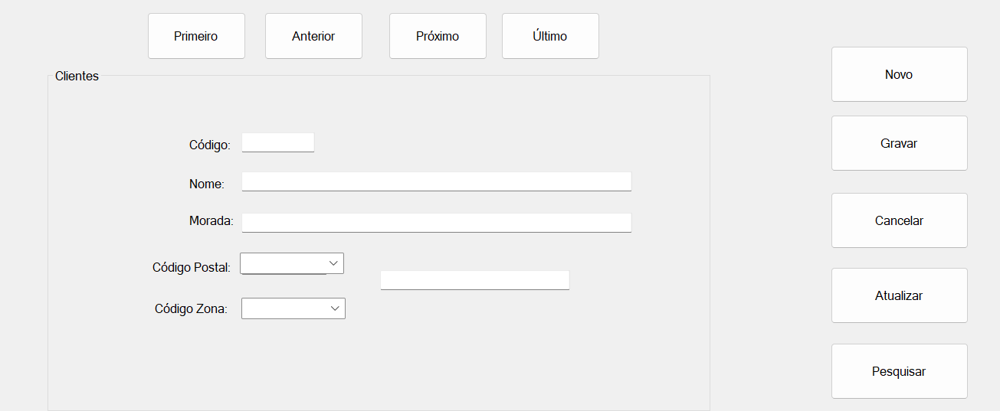

# Bases de Dados :1234:
 Aplicação desenvolvida em C# para demosntrar a ligação a uma base de dados em :arrow_right: MySql :arrow_left:.

 

 Este exemplo serve de demonstração para açao de formação **"Introdução ao Git e GitHub"**.

 ## Operações Suportadas
Nete momento, a aplicação suporta as seguintes ações:
- Inserção;
- Eliminação;
- Atualização;
- Pesquisa.

 ## Tecnologias Utilizadas 
 - Visual Studio;
 - C#;
 - MySql;
 - Git;
 - GitHub Desktop;
 - Plataforma GitHub.

 ## Sítio Oficial

Descarregue esta aplicação em [www.basedados.com](https://www.basedados.com)